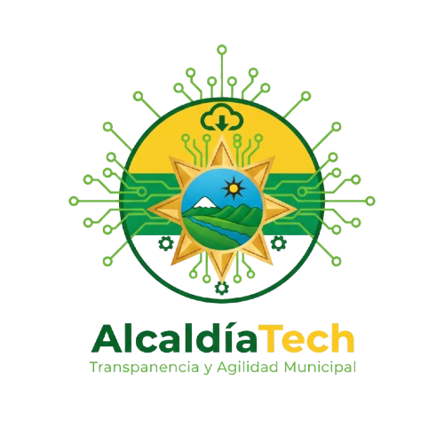

<!-- ===================== ENCABEZADO CON LOGO ===================== -->

  
<b>Plataforma Digital de Gestión de Multas y Comparendos</b> 
  <i>“Tecnología al servicio de los ciudadanos de Palermo”</i>

  

  
<b>Servicio Nacional de Aprendizaje (SENA)</b> 
  Tecnólogo en Análisis y Desarrollo de Software · 2025

---

## 💡 ¿Por qué “AlcaldíaTech”?

El nombre **“AlcaldíaTech”** combina dos conceptos clave:  
- **“Alcaldía”**, que representa la autoridad local encargada de la gestión ciudadana.  
- **“Tech”**, abreviatura de *Technology*, que simboliza innovación, digitalización y modernización administrativa.  

Este nombre fue elegido para reflejar la visión de una **Alcaldía moderna y transparente**, que utiliza la tecnología como medio para optimizar la gestión pública y acercar los servicios al ciudadano.  
En este caso, la **Alcaldía de Palermo (Huila)** busca digitalizar la administración de comparendos, facilitando procesos más ágiles y eficientes.

---

## 🧩 Descripción del Proyecto

**AlcaldíaTech** es una plataforma integral para la **gestión digital de comparendos y multas** municipales.  
Permite a la Alcaldía de Palermo registrar, administrar y consultar infracciones de tránsito, agilizando los procesos tanto para funcionarios como para ciudadanos.

Su propósito principal es **automatizar los procesos de registro, pago y consulta de multas**, garantizando trazabilidad, eficiencia y transparencia institucional.

---

## 🎯 Objetivos

- Digitalizar el registro y control de comparendos.  
- Permitir acuerdos de pago controlados por el área de finanzas.  
- Facilitar la consulta de multas para los ciudadanos.  
- Reducir los tiempos administrativos.  
- Mejorar la trazabilidad y la transparencia del proceso.  
- Generar reportes estadísticos para la Alcaldía.  

---

## ⚙ Tecnologías Utilizadas

| Categoría | Tecnologías |
|------------|-------------|
| **Backend** | .NET 8 · C# · Entity Framework Core |
| **Frontend / App** | Angular |
| **Base de Datos** | PostgreSQL / SQL Server |
| **Arquitectura** | N-Capas · Servicios REST |
| **Integración / Comunicación** | SignalR · API REST · JWT |
| **DevOps / Despliegue** | Docker · Docker Compose · Nginx |
| **Pruebas / Calidad** | xUnit · Jest  |
| **Documentación** | Swagger · Markdown · Mermaid |
| **Gestión del Proyecto** | ClickUp · GitHub Projects |

---

## 🧠 Arquitectura del Sistema

**AlcaldíaTech** se construye bajo una **arquitectura en N-capas**, que permite escalabilidad, seguridad y mantenibilidad del sistema.

### Capas Principales

- **Capa Web / API (Presentación)**  
  Desarrollada en ASP.NET Core, expone servicios REST hacia el frontend y otros módulos.

- **Capa de Negocio (Business Layer)**  
  Contiene la lógica de gestión de comparendos, acuerdos y pagos.

- **Capa de Datos (Data Layer)**  
  Implementa acceso a base de datos mediante repositorios genéricos y Entity Framework.

- **Capa de Entidades (Entity Layer)**  
  Define los modelos del dominio y los DTOs de transferencia entre capas.

---

## 👥 Roles de Usuario

| Rol | Descripción |
|------|--------------|
| **Inspectora** | Registra y administra las multas emitidas en el municipio. |
| **Funcionario de Finanzas** | Gestiona los acuerdos de pago y controla los abonos de los ciudadanos. |
| **Usuario Final (Ciudadano)** | Consulta sus multas, acuerdos y estados de pago. |

---

## 🚓 Funcionalidades Clave

- Registro y gestión de comparendos digitales.  
- Administración de acuerdos de pago.  
- Consulta ciudadana de infracciones y estado de cuenta.  
- Generación de reportes dinámicos para la Alcaldía.  
- Notificaciones automáticas.  
- Integración con pasarela de pagos.  
- Panel de control administrativo.  

---

## 👨‍💻 Equipo de Desarrollo

| Integrante | Rol / Responsabilidades |
|-------------|--------------------------|
| **Ingrid Medina** | **Líder del Proyecto** · Coordinación general · Desarrollo Backend / Frontend. |
| **Camilo Losada** | **Desarrollador Full-Stack** · Arquitectura y soporte técnico. |
| **Daniel Caicedo** | **Desarrollador FrotEnd** .Arquitectura y soporte en FrotEnd |

---

## 🧱 Repositorios del Proyecto

| Módulo | Descripción | Repositorio |
|---------|--------------|-------------|
| **alcaldiatech-api** | API REST desarrollada en .NET 8. | *(En construcción)* |
| **alcaldiatech-portal** | Interfaz web desarrollada en Angular. | *(En construcción)* |
| **alcaldiatech-app** | Aplicación móvil híbrida (React) para ciudadanos. | *(En construcción)* |
| **alcaldiatech-docs** | Repositorio de Documentacion tecnica y funcional del sistema . | *(En construcción)* |
| **alcaldiatech-db** |contiene la estructura de la base de datos | *(En construcción)* |

---

## 📜 Licencia

Proyecto académico desarrollado para el **Servicio Nacional de Aprendizaje (SENA)** en el marco del programa **Tecnólogo en Análisis y Desarrollo de Software (ADSO)**.  
Uso con fines educativos y demostrativos.

